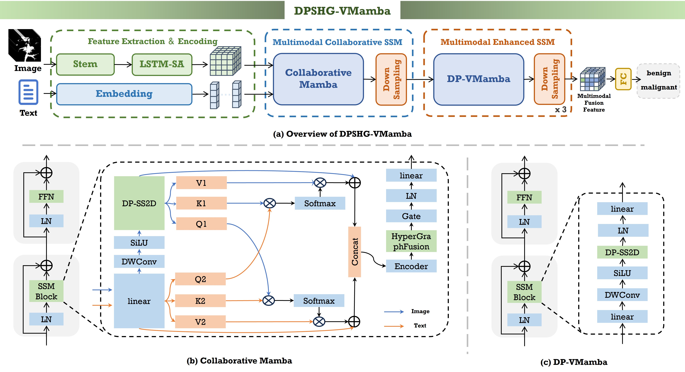
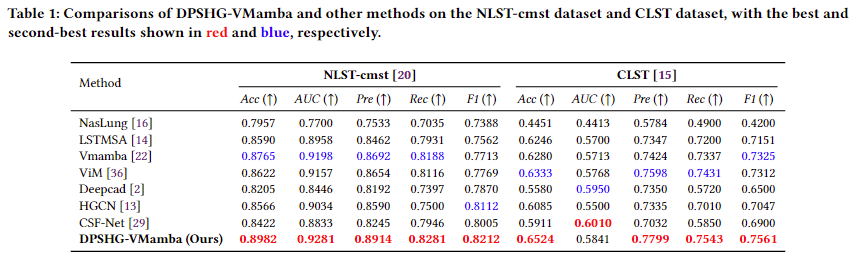

# Dual-Perspective Scanning and Hypergraph Fusion-Driven for Pulmonary Nodule Malignancy Prediction

The overall framework of our proposed DPSHG-VMamba:



Comparison of different SOTA methods on the NLST-cmst dataset and CLST dataset:



## Pre-requisties

- Linux

- Python>=3.7

- NVIDIA GPU + CUDA12.1 cuDNN8.9

## Installation

Clone this repository and navigate to it in your terminal. Then run:

```
pip install -r requirements.
```

## Data Preparation
The NLST-cmst dataset, derived from the National Lung Screening Trial (NLST, you can find it in [Link](https://cdas.cancer.gov/datasets/nlst/)) initiated by the National Cancer Institute, includes 433 subjects with Regions of Interest (ROI) of pulmonary nodules annotated by physicians. Building upon conventional CT imaging, the dataset has been further enhanced and expanded into a cross-modal, longitudinal, spatiotemporal format, comprising data from 335 subjects. Each subject underwent at least two CT scans with intervals ranging from 6 to 12 months, providing invaluable sequential data for studying lesion progression. In addition to the imaging data, the dataset records detailed clinical information for each subject, including age, gender, smoking status, and screening results. These metadata offer robust support for data mining and multivariate analysis. Since the original data did not specify the exact locations of pulmonary nodules, experienced radiologists were specially invited to meticulously annotate each case. Every case was reviewed by professional physicians, who delineated the three-dimensional regions of interest (ROI) of the pulmonary nodules. The volumetric data were then standardized to a fixed size of 16×64×64 voxels through isotropic resampling, ensuring consistency and comparability in subsequent analyses. Importantly, the malignancy of all pulmonary nodules was confirmed using rigorous pathological gold standards, including biopsy and post-operative diagnosis, which greatly enhances the diagnostic accuracy and clinical applicability of the dataset. Finally, the dataset is split in a 4:1 ratio into 268 training samples and 67 independent test samples, with both subsets maintaining a high degree of consistency in terms of subjects’ demographic and disease-related characteristics.

The CLST dataset includes 109 patients with 317 CT sequences and 2,295 annotated nodules ([Link](https://www.nature.com/articles/s41597-024-03851-7)). Nodules were categorized as: malignant (invasive adenocarcinoma, microinvasive adenocarcinoma, in situ adenocarcinoma, and other malignant subtypes) and benign (inflammation and other benign subtypes). For longitudinal analysis, 30 cases with paired CT scans totaling 60 data points were selected. The entire dataset is employed for testing purposes. Three-dimensional ROIs measuring 16×64×64 voxels were extracted based on the locations of the nodules, and nodule diameters were recorded as key clinical features. This dataset facilitates research into the dynamics of nodule progression and the development of computational models for distinguishing between malignant and benign lesions, thereby contributing to advancements in precision oncology.

## Training

- training for LSTMSA Model:

```
python train_LSTMSA.py
```

- training for DPSHG-VMamba Model:

```
python train.py
```
